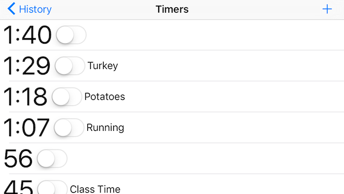
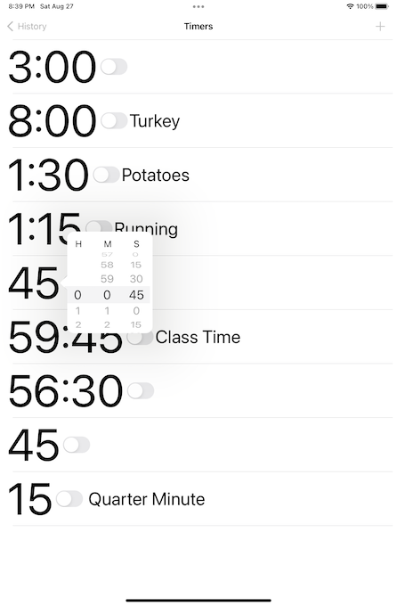
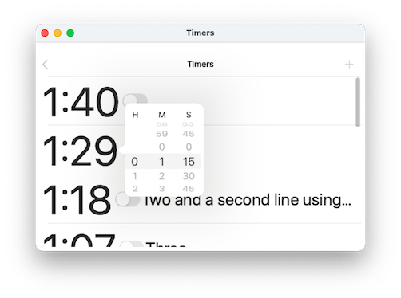

#  Timers

A simple iPad/iPhone/Mac app giving you a set of labeled countdown timers.

## Screenshots:

**Timers** on iPod Touch running iOS 9
 

**Timers** on iPad running iOS 15
 

**Timers** on Mac running macOS Monterey (12.5) 

## How to Build

* Open the project in Xcode.
* Select the Timers project item near the top of the Project Navigator
* In the Signing&Capabilites tab replace 'com.example' with your preferred bundle identifier prefix.
* Set your signing team.

## See also:

https://mandelics.com/urgency/

https://www.amazon.com/YYGIFT-Kitchen-Interval-Magnetic-Whiteboard/dp/B01AD7JLAY

referenced from https://www.kingarthurbaking.com/blog/2022/06/22/tips-for-baking-with-brain-fog

## How It Works:

* T1MTimer - one timer. An array of these is the model for this app. plist is the file format. When a timer changes, it notifies its delegate, the T1MTimerListController
* T1MTimerListController - the main viewcontroller. owns and persists and Array of T1MTimer s. 
* T1MPopTimeViewController - the popup controller for setting time durations (and sounds)
* T1MHistoryController - shows the history of completed timers.
* T1MTimerCell - displays one timer. Clicking on the time creates a T1MPopTimeViewController to show the customized countdown timer setter U.I.

Helpers:
* Heartbeat - Twice a second it calls all the T1MTimer so they can update their state.
* NSTimer+T1M - Put a timer on the runloop. In MacOS, it was so we'd keep running when menu was down, or in modal dialogs. Still needed?
* TimeIntervalFormatter - int to hours:minutes:seconds format and back.
* T1MIntervalPickerView - replace the UIDatePicker in countdown mode: works on Mac. Can set seconds.
* UIView+T1M - traverse the superview tree looking for instances that are of a class.

## DONE:

* File i/o
* Added actual Timer code
* can delete/insert timers.
* a simple standard of/on switch toggles from running to idle, or from alarming to idle.
* alarms blink.
* numeric text left jusified. Larger.
* Popover to set the time of timers. You can't set the time of a running timer.
* Timers are all referenced to NSDate, so they still "run" even when the app is in background.
* Replace NSLayoutConstraints with layoutSubViews.
* fixed by using TextField instead of TextView is wrapped around the existing text, so if there is no pre-existing text I can't click in to it to edit it. (everywhere, including Catalyst: )
* Undo and redo for adding and removing timers, changing timer durations, and while typing
* Popover on iPad, sheet on iPhone, or split-view
* While a timer is running show progress bar and end time.
* Can set the seconds value of the timers. Replaced UIDatePicker with one based on UIPickerView. 0 5 15 30 45
* fixed: Text is too small on iPad, too large on iPodTouch.
* fixed: layout bugs.
* fixed: Dynamic text bugs
* Icon, LaunchScreen, beginnings of History View.
* alarm beeps.
* LaunchScreen uses an image so the image will be re-scaled appropriately.
* When the timer goes off, beep, speak the label
* Compatibility back to iOS 9: iPod Touch running 9.3.5 beeps and speaks.
* When a timer is idle, tapping its count-down timer shows the time U.I. When it is running or alarming, it changes the timer to idle.
* NSAppleScriptEnabled in Info.plist allows Applescript to move and resize the window.

## In Progress

* Beginings of: when app is not frontmost, schedule notifications for running timers (cancel when come to front.)

## TODO:

* Can I use intrinsicContentSize to get a long UITextField to wrap? probably not. A non-scrolling UITextView should work, if I can hook it to the cell's intrinsicContentSize
* Undo bugs pertaining to ending edits.
* alarm choice.
* does not work on Mac: Swipe to delete, undo edit menu names, redo edit menu names
* Compatibility back to iOS 9: Tested on iOS 9 iPad. Works, except that beep and speak are silent. iPod Touch running the same version of the operating system beeps and speaks. I played around with the audio session, and even tried kSystemSoundID_Vibrate. Setting kAudioServicesPropertyIsUISound to 0, Still broken.
  UInt32 flag = 0;  // did not work.
  AudioServicesSetProperty(kAudioServicesPropertyIsUISound, sizeof(UInt32), &ident, sizeof(UInt32), &flag);

## Random Thoughts

~When I type, I get multiple lines, but after save/restore, is one line.~

? Pre-label some timers with which burner, which oven. Preset beeps, too.
? When the timer goes off, beep, speak the label, beep, repeat

https://www.metafilter.com/196264/Tips-for-baking-while-dealing-with-brain-fog#8284566 :
"The Paprika Recipe Management app is not free, but it provides many useful features. 

It slurps in recipes from webpages, and provides a very good grocery list manager that can sync across multiple devices. 

While cooking, you can check off ingredients as you add them and steps as you do them, and anywhere a recipe includes a time, you can just click directly on the time to start a timer!"

## Licence

Apache V 2.0 license

